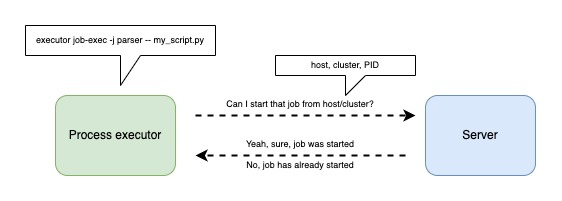

# Jobs

[](https://codecov.io/gh/antgubarev/jobs)

Processes manager (cron jobs, workers, etc.) which allows runtime control and watching processes in distributed systems.

## Features
- Multiclustrer (Comming soon...)
- Diferent process lanuching types (once at host or once at cluster)
- Simple and fast install (self-storage, free-dependency)
- Stopping process with jobsctl or API (Comming soon...)
- Jobs observability (logs and statuses) (Comming soon...)
- You can create self GUI with HTTP API

## Components


### Server
Jobs server is a control plane. Exposes jobs API. Manages job's config and launch processes with defirent atomicity types 
and controls statues.
### Executor
Launches jobs's processes on the hosts, controls process status. Not required components, you may lauch process by other way, 
but you also must use jobs API for register processess.
### Jobsctl
Allows use API server comfortably instead of use Postman/Curl/etc. I recommended use `jobsctl`.

## Getting started
To start you need run server and create first job config. That's all, you may start you processes.
#### Server
Server can be run as binary or container. Also you can use [example kubernetes manifests]().

**Binary**
Download the appropriate version for your platform from [Jobs Releases](https://github.com/antgubarev/jobs/releases). 
Once downloaded, the binary can be run from anywhere. You don’t need to install it into a global location. 
This works well for shared hosts and other systems where you don’t have a privileged account.

Ideally, you should install it somewhere in your PATH for easy use. /usr/local/bin is the most probable location.

Than run the server (`jobsrv` from downloaded `tar.gz` file)

```bash
jobsrv -listen '0.0.0.0:8080' -dbPath '/home/me/jobs.dat'
```

**Docker**
```bash
docker pull antgubarev/jobs:{version}
docker run jobssrv -p 8080:8080 -v /home/me/jobs.dat:/home/me/jobs.dat antgubarev/jobs:{version} -listen '0.0.0.0:8080' -dbPath '/home/me/jobs.dat'
```

**Kubernetes**
Comming soon...

#### Create your first job

Server needs to know you jobs configs.

`jobsctl` is most simple way:
```bash
jobsctl -s localhost:8080 job create -n my-first-job -l host
```

Or use `API`:
```curl 
curl -X POST http://localhost:8080/job -d '{"name": "my-first-job", "lockMode": "host"}'
```

#### Running job
In general `running job` asks API server `can I run a new job process`. Server response `yes|no` and registers new process. 
Jobsexec does it instead of you.

```jobsexec
jobsexec -s http://localhost:8080 -j my-first-job -- my_script.py
```
It can be used in `crontab` or `systemd` or etc.

But you can do it yourself in your script:
```curl
curl -X POST http://localhost:8080/executions -d '{"job": "my-first-job", "host": "srv1"}'
```

Depending job config server registers new process or response error if job has already started, and you need exit from your script.
`jobsexec` does it instead of you.

# Contributing
- Fork it
- Create your feature branch (git checkout -b my-new-feature)
- Commit your changes (git commit -am 'Added some feature')
- Push to the branch (git push origin my-new-feature)
- Create new Pull Request
Remember about linters